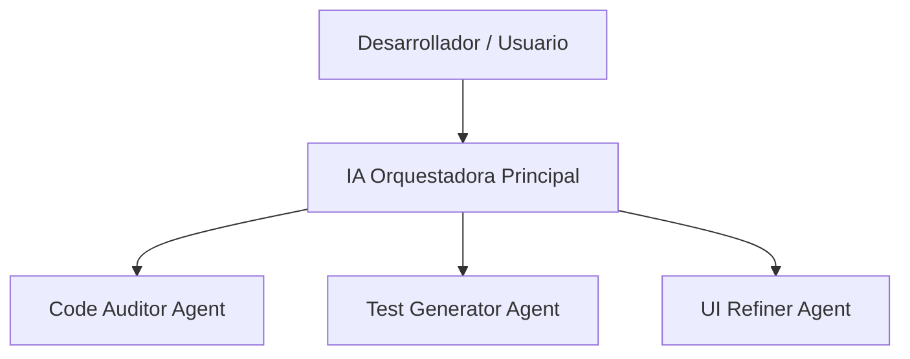

# Directorio de Agentes de IA - FUT Manager App

Este archivo documenta la estructura de los agentes de Inteligencia Artificial utilizados para el desarrollo, auditoría, pruebas y mantenimiento del proyecto full-stack **FUT Manager**.

Los agentes están definidos como roles y lógicas de sistema modulares que residen en la carpeta `./agents/` de este repositorio.

---

## 🤖 Arquitectura y Catálogo de Agentes

El desarrollo de este software emplea un enfoque multi-agente, donde cada agente asume un rol de especialista y colabora en el flujo general de trabajo coordinado por la IA principal (AntiGravity).

### 1. 🔍 Agente Auditor de Código (`/agents/CodeAuditorAgent.txt`)
* **Propósito**: Realizar auditorías estáticas del código fuente de Spring Boot y MySQL.
* **Áreas de Enfoque**:
  * Prevención del problema de consultas N+1 en Hibernate/JPA.
  * Verificación de la arquitectura limpia (uso de DTOs en lugar de entidades directas).
  * Validación del uso correcto de transacciones (`@Transactional`).
  * Estandarización de las respuestas HTTP y el manejo global de errores.

### 2. 🧪 Agente Generador de Pruebas (`/agents/TestGeneratorAgent.txt`)
* **Propósito**: Automatizar la creación de la suite de pruebas unitarias en el backend.
* **Áreas de Enfoque**:
  * Implementación de pruebas aisladas con `Mockito` sin requerir base de datos física.
  * Pruebas de validación de límites estadísticos (valores entre 1 y 99).
  * Verificación de flujos alternativos y manejo de excepciones en servicios.

### 3. 🎨 Agente Refinador de UI (`/agents/UiRefinerAgent.txt`)
* **Propósito**: Optimizar la interfaz de usuario en React y el diseño CSS nativo para garantizar una experiencia visual premium.
* **Áreas de Enfoque**:
  * Estética oscura inspirada en EA Sports FC / FIFA Ultimate Team.
  * Transiciones suaves y efectos de movimiento 3D/hover en las cartas de jugadores.
  * Diseño responsivo para ordenadores y dispositivos móviles.
  * Diseño de estados de interfaz (pantallas de carga y estados vacíos).

---

## 🚀 Cómo Activar y Usar los Agentes

Para invocar a un agente durante una sesión de desarrollo con la IA principal (AntiGravity, VSCode Copilot o similar), se debe pasar la lógica correspondiente ubicada en el archivo de texto.

### Ejemplo de Prompt para Auditoría de Backend:
> *"Usa la lógica definida en `agents/CodeAuditorAgent.txt` para inspeccionar la clase `JugadorService.java` y proponer mejoras relativas a la eficiencia de las consultas en la base de datos."*

### Ejemplo de Prompt para Generar Tests:
> *"Basándote en `agents/TestGeneratorAgent.txt`, genera una nueva suite de pruebas unitarias para validar las operaciones de actualización del servicio `EquipoService`."*
