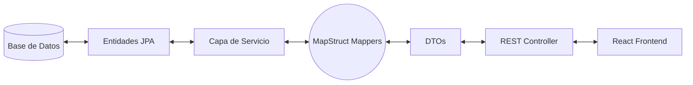

# Explicación e Incorporación de DTOs (Data Transfer Objects)

Este documento explica de forma detallada qué son los DTOs, por qué son fundamentales en el desarrollo de aplicaciones empresariales full-stack, y cómo se han incorporado en el proyecto **FUT Manager** para optimizar la comunicación entre el backend y el frontend.

---

## 📘 ¿Qué es un DTO (Data Transfer Object)?

Un **DTO (Objeto de Transferencia de Datos)** es un patrón de diseño de software cuyo propósito es transportar datos entre diferentes subsistemas o capas de una aplicación (en nuestro caso, desde la capa de base de datos a través de la API REST hacia el cliente React).



### Diferencias Clave: Entidad vs DTO

| Aspecto | Entidad JPA (`@Entity`) | DTO (`Data Transfer Object`) |
|---|---|---|
| **Propósito** | Representar y modelar tablas y relaciones en la Base de Datos. | Transportar datos de forma optimizada y segura para el cliente. |
| **Anotaciones** | `@Entity`, `@Table`, `@Id`, `@OneToMany`, `@ManyToOne`. | Anotaciones simples de datos (`@Data`, `@Builder`, `@Json`). |
| **Relaciones** | Contiene colecciones y referencias circulares complejas. | Aplanado (representa relaciones mediante IDs o nombres planos). |
| **Acoplamiento** | Altamente acoplado al esquema físico de la base de datos. | Desacoplado; se adapta a las necesidades de la vista o frontend. |

---

## 🌟 Beneficios de Incorporar DTOs en el Proyecto

1. **Eliminación de Bucles de Serialización Infinita**:
   Al tener una relación bidireccional entre `Equipo` (que tiene muchos jugadores) y `Jugador` (que pertenece a un equipo), la serialización directa de entidades a JSON produce un bucle sin fin (`StackOverflowError`). Los DTOs rompen este ciclo al contener únicamente los campos necesarios y aplanar las relaciones.
2. **Seguridad y Encapsulamiento**:
   Evita exponer información interna del esquema de la base de datos o campos sensibles (como contraseñas, auditoría de creación, etc.) directamente al cliente.
3. **Eficiencia en Red**:
   Reduce el tamaño de la carga útil del JSON transmitiendo exclusivamente los atributos que la interfaz de React necesita mostrar.
4. **Desacoplamiento Arquitectónico**:
   Si la base de datos cambia (por ejemplo, el nombre de una columna), solo se modifica la entidad y el mapeador. El DTO y el frontend React permanecen intactos.

---

## 💻 Implementación de DTOs en FUT Manager

A continuación se muestran los códigos fuente de los DTOs creados, los cuales evitan bucles infinitos mapeando las relaciones a datos primitivos/planos (`equipoId`, `equipoNombre`, `jugadorId`, `jugadorNombre`).

### 1. DTO de Equipo (`EquipoDTO.java`)
```java
package com.example.futmanager.dto;

import lombok.*;

@Data
@NoArgsConstructor
@AllArgsConstructor
@Builder
public class EquipoDTO {
    private Long id;
    private String nombre;
    private String liga;
    private String pais;
    private String escudoUrl;
}
```

### 2. DTO de Jugador (`JugadorDTO.java`)
```java
package com.example.futmanager.dto;

import lombok.*;

@Data
@NoArgsConstructor
@AllArgsConstructor
@Builder
public class JugadorDTO {
    private Long id;
    private String nombre;
    private String nacionalidad;
    private String posicion;
    private String fotoUrl;
    private Long equipoId;
    private String equipoNombre;
}
```

### 3. DTO de Carta FUT (`CartaFUTDTO.java`)
```java
package com.example.futmanager.dto;

import com.example.futmanager.model.TipoCarta;
import lombok.*;

@Data
@NoArgsConstructor
@AllArgsConstructor
@Builder
public class CartaFUTDTO {
    private Long id;
    private Integer rating;
    private Integer ritmo;
    private Integer tiro;
    private Integer pase;
    private Integer regate;
    private Integer defensa;
    private Integer fisico;
    private TipoCarta tipoCarta;
    private Long jugadorId;
    private String jugadorNombre;
}
```

---

## 🛠️ Cómo se Incorporan en el Flujo de la Aplicación

Los DTOs se incorporan de forma transparente en la capa de servicios mediante el uso de la biblioteca de mapeo automático **MapStruct**:

1. **Lectura (GET)**:
   * El controlador llama al servicio.
   * El servicio obtiene las entidades de base de datos desde el `JpaRepository`.
   * El mapper automático convierte la entidad (`Jugador`) a su DTO (`JugadorDTO`) mapeando automáticamente el id y el nombre del club asociado.
   * El controlador retorna el DTO al cliente React.
2. **Escritura (POST/PUT)**:
   * El controlador recibe un JSON con la estructura del DTO.
   * El servicio valida el DTO (como los rangos de estadísticas entre 1 y 99).
   * El mapper convierte el DTO de vuelta a una Entidad.
   * El `JpaRepository` persiste los datos en la base de datos MySQL.

> [!NOTE]  
> Para presentar el archivo `DTO.pdf` requerido, puede exportar este archivo `DTO.md` directamente a formato PDF utilizando un editor de texto (como VS Code con la extensión *Markdown PDF* o el navegador seleccionando *Guardar como PDF*).
