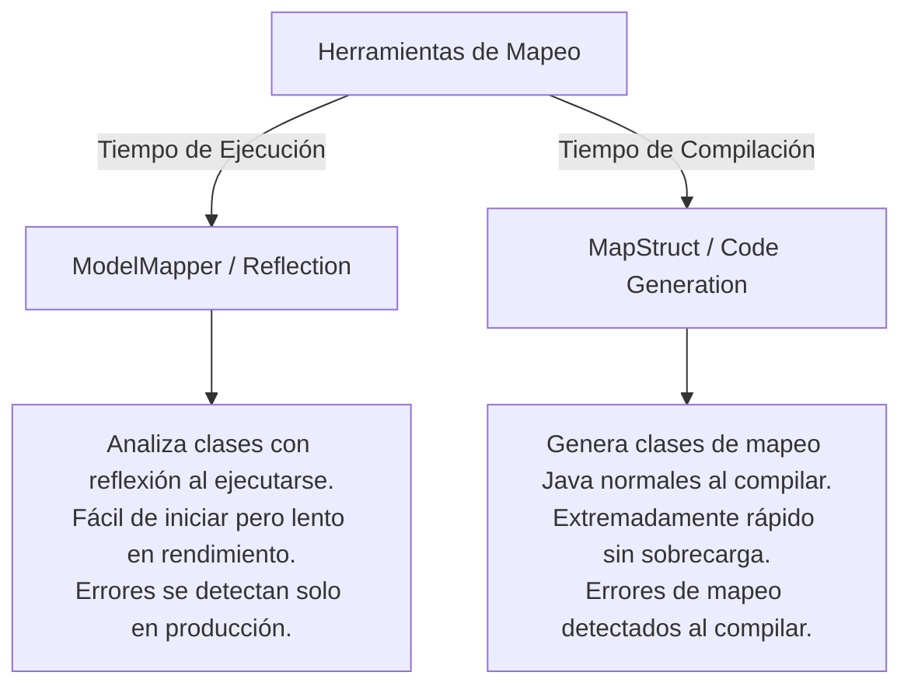
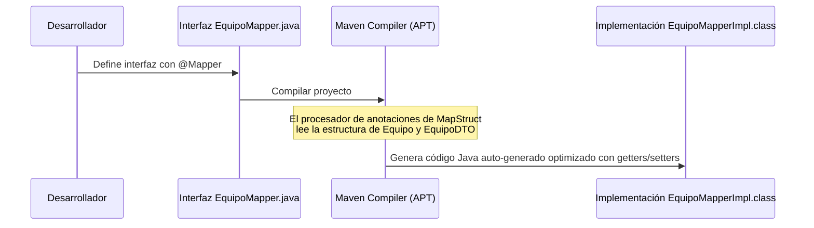

# Mapeo Automático de Datos: MapStruct vs ModelMapper

Este documento explica de forma conceptual y visual en qué consiste el mapeo automático de datos, compara las dos principales tecnologías en el ecosistema Spring Boot (**MapStruct** y **ModelMapper**) y justifica la elección de la solución implementada.

---

## 🗺️ ¿Qué es el Mapeo Automático de Datos?

El **mapeo automático de datos** es un proceso que asocia campos de un modelo de datos con campos de otro modelo (por ejemplo, copiar las propiedades de una entidad `@Entity` de JPA a un objeto `DTO` de forma automática). 

En lugar de escribir manualmente código repetitivo (código *boilerplate*) como:
```java
jugadorDTO.setId(jugador.getId());
jugadorDTO.setNombre(jugador.getNombre());
jugadorDTO.setPosicion(jugador.getPosicion());
// etc...
```
Se utiliza una biblioteca que se encarga de realizar esta asignación a través de reglas predefinidas o convenciones de nombres.

---

## 📊 Comparativa de Tecnologías: MapStruct vs ModelMapper

Existen dos estrategias principales para abordar el mapeo de objetos en Java:



### Tabla Comparativa

| Criterio | MapStruct (Implementado) | ModelMapper |
|---|---|---|
| **Estrategia** | **Generación de Código (Compile-time)**. | **Reflexión Dinámica (Runtime)**. |
| **Rendimiento** | **Máximo**. Equivale a escribir los *setters* y *getters* a mano. | **Moderado/Bajo**. La reflexión de Java añade sobrecarga en CPU. |
| **Detección de Errores** | **Compilación**. Si un campo no coincide o está mal configurado, el compilador falla. | **Ejecución**. Los errores se descubren mediante excepciones al ejecutar. |
| **Seguridad de Tipos** | **Sí**. Al compilar genera código Java fuertemente tipado. | **No**. Las conversiones se evalúan de forma dinámica en caliente. |
| **Boilerplate** | Requiere definir interfaces `@Mapper`. | Requiere configuración de beans y mapeos explícitos en tiempo de ejecución. |

---

## 🛠️ Flujo de Trabajo Visual en MapStruct

El siguiente diagrama detalla cómo MapStruct genera código Java normal a partir de nuestras interfaces de mapeo durante la fase de compilación de Maven (`mvn compile`):



---

## 💻 Ejemplo de Implementación en Código

Durante la compilación de nuestro backend, MapStruct ha auto-generado la clase `JugadorMapperImpl.java` en el directorio de código generado de Maven. El código generado equivale a la asignación manual eficiente:

```java
@Component
public class JugadorMapperImpl implements JugadorMapper {
    @Override
    public JugadorDTO toDto(Jugador jugador) {
        if (jugador == null) {
            return null;
        }
        JugadorDTO.JugadorDTOBuilder jugadorDTO = JugadorDTO.builder();
        jugadorDTO.id(jugador.getId());
        jugadorDTO.nombre(jugador.getNombre());
        jugadorDTO.posicion(jugador.getPosicion());
        jugadorDTO.fotoUrl(jugador.getFotoUrl());
        jugadorDTO.nacionalidad(jugador.getNacionalidad());
        // Mapeo personalizado definido con @Mapping
        jugadorDTO.equipoId(jugadorEquipoId(jugador));
        jugadorDTO.equipoNombre(jugadorEquipoNombre(jugador));
        return jugadorDTO.build();
    }
    // Métodos auxiliares generados automáticamente
}
```
Esto garantiza que la aplicación sea robusta, segura contra fallos en producción y extremadamente rápida.
